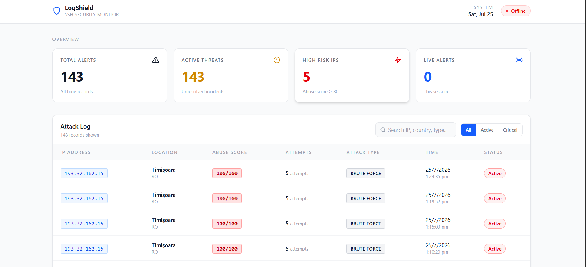
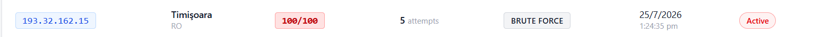
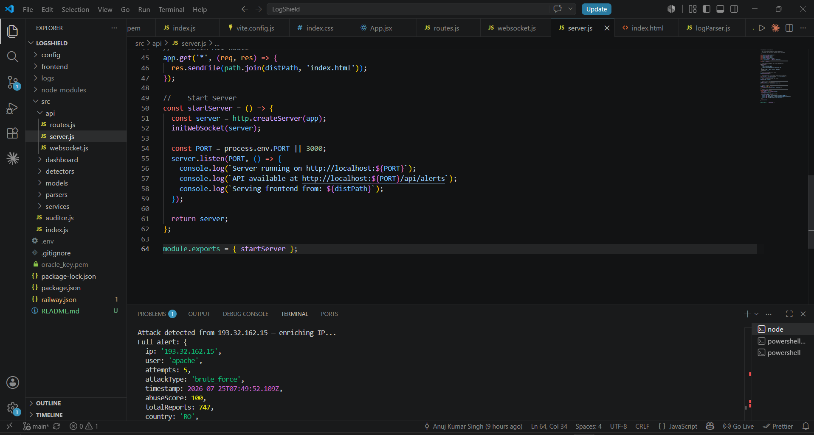
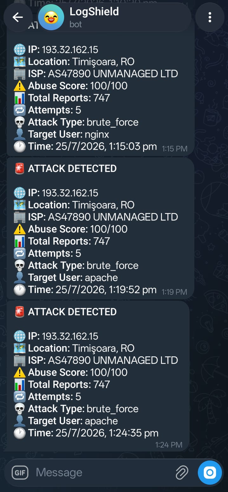

# 🛡️ LogShield — Real-time SSH Security Monitor

A real-time SSH security log monitoring system that connects to a Linux server via SSH, streams `/var/log/auth.log` live, detects brute force attacks using a sliding window algorithm, enriches attacker IPs with threat intelligence, and sends instant Telegram alerts — all visible on a live React dashboard.

Built solo as a portfolio project to demonstrate systems thinking, full-stack engineering, and the ability to ship a real security tool that catches real attackers.

**🔗 Live Dashboard:** [logshield-production-b274.up.railway.app](https://logshield-production-b274.up.railway.app)
**🔗 Repo:** [github.com/Anuj8506/LogShield](https://github.com/Anuj8506/LogShield)

---

## 📸 Screenshots

### Dashboard — Live attack monitoring with real attacker IPs


### Attack Row — Romanian IP with 100/100 AbuseIPDB score


### Terminal — SSH connected, attack detected, IP enriched in real time


### Telegram — Instant alert fired to phone the moment attack is detected

---

## 🧭 Why this project

Every Linux server on the internet is being attacked right now. Automated bots scan millions of IPs 24/7, trying common usernames like `root`, `admin`, `jenkins`, `apache` with dictionary passwords. Most server owners have no idea this is happening.

LogShield solves this by reading the server's own auth log in real time, detecting when an IP crosses a suspicious threshold, looking up its reputation, and alerting you instantly — before damage is done.

The Romanian IP `193.32.162.15` in the screenshots above has been reported **747 times** on AbuseIPDB. LogShield caught it automatically within seconds of the 5th failed attempt.

## 🏗️ Architecture

```
Oracle Linux Server          Railway (Node.js)
/var/log/auth.log   →SSH→   LogShield Auditor
                                    ↓
                            ┌───────┴───────┐
                            ↓               ↓
                      MongoDB Atlas    Telegram Bot
                      (alerts saved)  (phone alerts)
                            ↓
                      Express API
                      WebSocket Server
                            ↓
                      React Dashboard
                      (live updates)
```

## ⚙️ Tech Stack

| Layer | Technology | Purpose |
|---|---|---|
| Backend | Node.js, Express | API server and auditor loop |
| SSH | ssh2 | Streams auth.log from remote Linux server |
| Database | MongoDB Atlas (Mongoose) | Persists all detected alerts |
| Real-time | WebSocket (ws) | Pushes live alerts to dashboard |
| IP Intel | AbuseIPDB API | Abuse confidence score and report count |
| Geolocation | ipinfo API | Country, city, ISP of attacker |
| Alerts | Telegram Bot API | Instant phone notification on attack |
| Frontend | React + Tailwind CSS + Vite | Live dashboard |
| Deployment | Railway | 24/7 cloud hosting |

---

## 🧠 How It Works

### 1. Log Parser
Raw auth.log lines are converted into structured objects using regex:

Jul 24 09:15:32 server sshd: Failed password for root from 193.32.162.15 port 4822 ssh2
↓
{ ip: '193.32.162.15', user: 'root', type: 'failed_password', timestamp: '...' }

Three line types are parsed: `failed_password`, `invalid_user`, and `accepted_password`. Everything else is ignored.

### 2. Sliding Window Anomaly Detector
Rather than a fixed window (which can miss attacks that straddle a boundary), LogShield uses a **sliding window**:

- Every failed attempt from an IP is timestamped and stored in memory
- On each new attempt, timestamps older than `BRUTE_FORCE_WINDOW_SECONDS` are pruned
- If the remaining count exceeds `BRUTE_FORCE_THRESHOLD`, an attack is flagged
- The tracker resets after firing so the same IP doesn't spam alerts

This means an IP making 4 attempts at 0:59 and 1 attempt at 1:01 is still caught — a fixed window would miss it.

### 3. IP Intelligence
When an attack is flagged, two API calls run in parallel via `Promise.all`:
- **AbuseIPDB** — returns an abuse confidence score (0–100) and total community reports
- **ipinfo** — returns country, city, and ISP

Running them in parallel cuts enrichment time roughly in half vs. sequential calls.

### 4. Alert Pipeline
Attack flagged → enrich IP → save to MongoDB → send Telegram → broadcast via WebSocket

The dashboard receives the alert via WebSocket and inserts it at the top of the table without any page refresh.

---

## 📋 Features

- Live SSH log streaming from any Linux server
- Sliding window brute force detection (configurable threshold and window)
- IP enrichment with abuse score, geolocation, and ISP
- Instant Telegram alerts with full attack details
- MongoDB persistence for historical analysis
- REST API for alerts, whitelist, and blacklist management
- React dashboard with live WebSocket updates, search, and filter
- Mock SSH mode for local development without a real server
- Base64 SSH key support for cloud deployment

---

## 🔍 Real Attack Example

This is a real alert LogShield generated during development — not simulated:

```json
{
  "ip": "193.32.162.15",
  "country": "RO",
  "city": "Timișoara",
  "isp": "AS47890 UNMANAGED LTD",
  "abuseScore": 100,
  "totalReports": 747,
  "attempts": 5,
  "attackType": "brute_force",
  "user": "apache",
  "timestamp": "2026-07-25T07:49:52Z",
  "resolved": false
}
```

This IP has been reported 747 times globally. It was trying to access an `apache` account that doesn't exist on the server.

---

## 🏗️ Key Engineering Decisions

**Why sliding window instead of fixed window for detection?**
A fixed window resets on a schedule — an attacker making 4 attempts at 0:59 and 1 at 1:01 would reset the counter and never be caught. A sliding window always looks at the last N seconds from *now*, so boundary-straddling attacks can't slip through.

**Why no Redis?**
LogPulse (a prior project) used Redis for sliding window rate limiting. LogShield skips it intentionally — the attack window is short (60 seconds), the data is small (just timestamps per IP), and the app runs as a single process. A plain JS object in memory is faster, simpler, and sufficient. Redis would add infrastructure overhead with no real benefit at this scale.

**Why `Promise.all` for IP enrichment?**
AbuseIPDB and ipinfo are independent — neither depends on the other's result. Running them sequentially would add ~500ms of unnecessary wait time per alert. `Promise.all` fires both simultaneously and waits for both, cutting enrichment latency roughly in half.

**Why base64 for the SSH private key on Railway?**
Railway doesn't support file uploads — only environment variables. Private keys are multi-line files. Base64 encoding converts the key to a single-line string that can be stored as an env var and decoded back at runtime with `Buffer.from(key, 'base64').toString('utf-8')`.

---

## 📡 API Endpoints

| Method | Endpoint | Description |
|---|---|---|
| GET | `/api/alerts` | Get all alerts, newest first |
| GET | `/api/alerts/:ip` | Get all alerts for a specific IP |
| PATCH | `/api/alerts/:id/resolve` | Mark an alert as resolved |
| DELETE | `/api/alerts/:id` | Delete an alert |
| GET | `/api/whitelist` | Get all trusted IPs |
| POST | `/api/whitelist` | Add an IP to whitelist |
| DELETE | `/api/whitelist/:id` | Remove from whitelist |
| GET | `/api/blacklist` | Get all blocked IPs |
| POST | `/api/blacklist` | Add an IP to blacklist |
| DELETE | `/api/blacklist/:id` | Remove from blacklist |

---

## 🚀 Running Locally

### Prerequisites
- Node.js v20+
- MongoDB Atlas account
- Linux server with SSH access (or use mock mode)
- AbuseIPDB API key — [abuseipdb.com](https://www.abuseipdb.com)
- ipinfo token — [ipinfo.io](https://ipinfo.io)
- Telegram bot token — create via [@BotFather](https://t.me/botfather)

### 1. Clone the repo

```bash
git clone https://github.com/Anuj8506/LogShield.git
cd LogShield
npm install
```

### 2. Create `.env`

```env
MONGO_URI=your_mongodb_atlas_uri
SSH_HOST=your.server.ip
SSH_PORT=22
SSH_USER=ubuntu
SSH_PRIVATE_KEY_PATH=/path/to/key.pem
ABUSEIPDB_API_KEY=your_key
IPINFO_TOKEN=your_token
TELEGRAM_BOT_TOKEN=your_bot_token
TELEGRAM_CHAT_ID=your_chat_id
PORT=3000
NODE_ENV=development
BRUTE_FORCE_THRESHOLD=5
BRUTE_FORCE_WINDOW_SECONDS=60
MOCK_SSH=false
```

Set `MOCK_SSH=true` to run without a real server — fake log lines will be generated every 2 seconds.

### 3. Start the backend

```bash
node src/index.js
```

### 4. Start the frontend (development)

```bash
cd frontend
npm install
npm run dev
```

Open `http://localhost:5173`

### 5. Build for production

```bash
cd frontend && npm run build
cd .. && node src/index.js
```

Open `http://localhost:3000`

## 📁 Project Structure

```
LogShield/
├── config/
│   └── db.js                   # MongoDB connection
├── src/
│   ├── models/
│   │   ├── Alert.js            # Attack alert schema
│   │   ├── Whitelist.js        # Trusted IPs schema
│   │   └── Blacklist.js        # Blocked IPs schema
│   ├── parsers/
│   │   └── logParser.js        # Regex parser for auth.log
│   ├── detectors/
│   │   └── anomalyDetector.js  # Sliding window detection
│   ├── services/
│   │   ├── sshTailer.js        # SSH streaming + mock mode
│   │   ├── ipIntel.js          # AbuseIPDB + ipinfo
│   │   └── telegramNotifier.js # Telegram alerts
│   ├── api/
│   │   ├── routes.js           # Express API routes
│   │   ├── websocket.js        # WebSocket server
│   │   └── server.js           # Express app
│   └── auditor.js              # Main pipeline
├── frontend/
│   └── src/
│       └── App.jsx             # React dashboard
├── railway.json                # Railway deployment config
└── package.json
```

## 🔮 What's Next

- Oracle Cloud firewall open → real SSH attacks detected on Railway dashboard
- Whitelist/blacklist UI in the dashboard
- Email alerts as an alternative to Telegram
- Port scan detection (currently only brute force)

---

## 👤 About

Built by **Anuj Kumar Singh** — Final Year IT Student, Delhi Technological University (DTU)

[GitHub](https://github.com/Anuj8506)